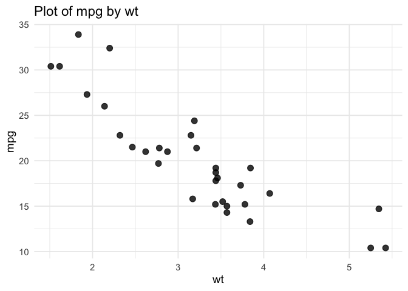
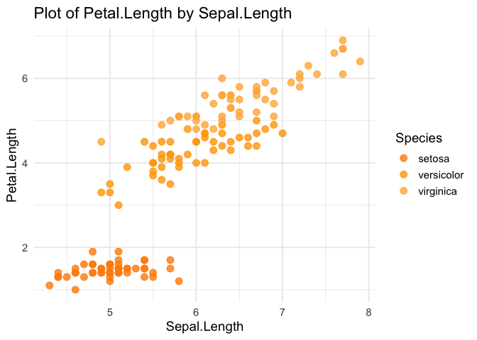

<!-- README.md is generated from README.Rmd. Please edit that file -->

# Newplot

[](https://github.com/Anakamura14/Newplot-Final-Project/actions/workflows/R-CMD-check.yaml)

## Vignette

The package vignette is provided as an R Markdown source file
(`newplot_vignette.Rmd`) in the `vignettes/` directory. It documents the
motivation, design decisions, and intended workflows supported by the
`newplot` package.

A rendered Word version of the vignette is included as part of the
course submission for readability.

------------------------------------------------------------------------

## Overview

**newplot** is an R package designed to make data visualization faster,
more intuitive, and more accessible. While **ggplot2** is powerful and
flexible, new and intermediate users often struggle with repeated setup
code, theme choices, palette selection, and handling grouping variables.
Even experienced analysts find themselves writing the same boilerplate
code across projects.

**newplot** addresses these challenges by offering:

- `new_plot()`: a simplified wrapper around ggplot2 that automates
  common aesthetic and structural decisions  
- `new_plot_gadget()`: an interactive Shiny gadget for building
  visualizations through a graphical interface  
- A consistent, colorblind-friendly default palette  
- Automatic grouping behavior and palette scaling  
- A reproducible, quoted-variable syntax that works cleanly inside
  scripts and R CMD check environments

The goal is to help users focus on **interpreting their data**, not
wrestling with syntax.

------------------------------------------------------------------------

## Motivation

The package was created to reduce friction for learners and analysts who
want clean, publication-ready graphics without extensive setup. Many
users struggle with:

- remembering which aesthetics belong to which geoms  
- choosing appropriate color scales  
- writing repetitive theme code  
- debugging tidy-evaluation errors  
- switching between interactive and script-based workflows

By automating these steps, **newplot** provides a stable and predictable
foundation for visualization.  
The Shiny gadget extends the package for teaching, prototyping, and
hands-on exploration by allowing users to visually construct a plot and
automatically generate reproducible code.

------------------------------------------------------------------------

## Installation

Install the development version from GitHub:

``` r
devtools::install_github("Anakamura14/Newplot-Final-Project")
#> Using GitHub PAT from the git credential store.
#> Downloading GitHub repo Anakamura14/Newplot-Final-Project@HEAD
#> ── R CMD build ─────────────────────────────────────────────────────────────────────────────
#>      checking for file ‘/private/var/folders/k6/g3skgp_505g84whf915p_py80000gn/T/RtmpQWJUCf/remotes17c633f827e4e/Anakamura14-Newplot-Final-Project-6e26dc9/DESCRIPTION’ ...  ✔  checking for file ‘/private/var/folders/k6/g3skgp_505g84whf915p_py80000gn/T/RtmpQWJUCf/remotes17c633f827e4e/Anakamura14-Newplot-Final-Project-6e26dc9/DESCRIPTION’
#>   ─  preparing ‘newplot’:
#>    checking DESCRIPTION meta-information ...  ✔  checking DESCRIPTION meta-information
#>   ─  checking for LF line-endings in source and make files and shell scripts
#>   ─  checking for empty or unneeded directories
#>    Omitted ‘LazyData’ from DESCRIPTION
#>        NB: this package now depends on R (>= 4.1.0)
#>        WARNING: Added dependency on R >= 4.1.0 because package code uses the
#>      pipe |> or function shorthand \(...) syntax added in R 4.1.0.
#>      File(s) using such syntax:
#>        ‘new_plot.Rd’
#> ─  building ‘newplot_0.1.0.tar.gz’
#>      
#> 
library(newplot)
```

------------------------------------------------------------------------

## Basic Usage

``` r
# Simple scatterplot
new_plot(mtcars, x = "wt", y = "mpg", type = "point")
```



``` r
# Grouped scatterplot
new_plot(
  iris,
  x = "Sepal.Length",
  y = "Petal.Length",
  group = "Species",
  type = "point",
  palette = "orange"
)
```



``` r
# Pipe-friendly workflow
mtcars |>
  dplyr::mutate(cyl = factor(cyl)) |>
  new_plot(x = "cyl", y = "mpg", group = "cyl", type = "violin")
#> Ignoring unknown labels:
#> • colour : "cyl"
```


These examples highlight newplot’s core purpose: reducing repetitive
code while producing clear, consistent, publication-ready figures.

------------------------------------------------------------------------

## Interactive Shiny Gadget

The `new_plot_gadget()` function creates an interactive visualization
builder:

``` r
# Launch the interactive Shiny gadget (not run during knitting)
if (interactive()) {
new_plot_gadget(iris)
}
```

The gadget allows users to:

- Select variables, plot types, palettes, and themes
- Preview the plot instantly
- Export the exact `new_plot()` code for reproducibility

This makes the gadget valuable for teaching, demonstrations, and rapid
prototyping.

------------------------------------------------------------------------

## Key Features

The `new_plot()` package streamlines the standard ggplot2 workflow by
automatically managing themes, colors, grouping structures, and palette
scaling. When no palette is specified, the function defaults to a
colorblind-friendly viridisLite scheme, ensuring clear and accessible
visualizations. Its tidy-evaluation–compatible design, which uses quoted
variable names, supports smooth behavior in scripts, pipelines, and R
CMD check environments. The package also includes an interactive Shiny
gadget that allows users to explore visualization options visually and
export reproducible code. Currently, `new_plot()` supports several
commonly used plot types, including point, line, boxplot, and violin,
covering a wide range of exploratory and instructional use cases.

------------------------------------------------------------------------

## Future Development

There are several promising directions for extending the `new_plot()`
package. One goal is to expand the range of supported geoms by
incorporating histograms, density plots, bar charts, smoothing layers,
and other visualization types commonly used in exploratory analysis.
Future versions may also introduce more advanced thematic controls,
enabling users to apply reusable style templates or
organization-specific formatting standards. Additional enhancements to
the palette system—such as improved contrast checking, expanded
colorblind-friendly options, and dynamic palette scaling—would further
strengthen accessibility. The Shiny gadget has significant potential for
growth as well, including features such as faceting controls, image
export options, and built-in tutorials for instructional settings.
Finally, continued refinement of internal validation and automated
testing would help prepare the package for broader use, including
potential submission to CRAN.
